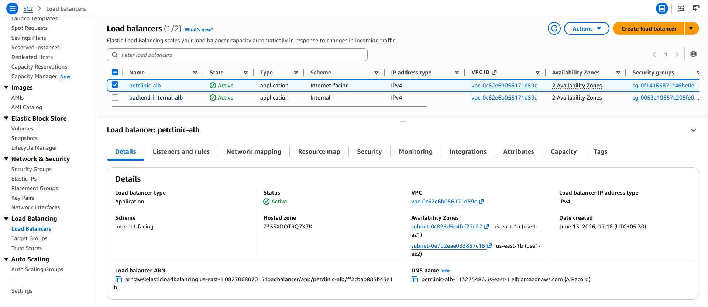
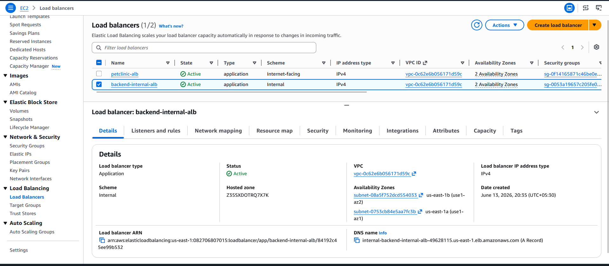
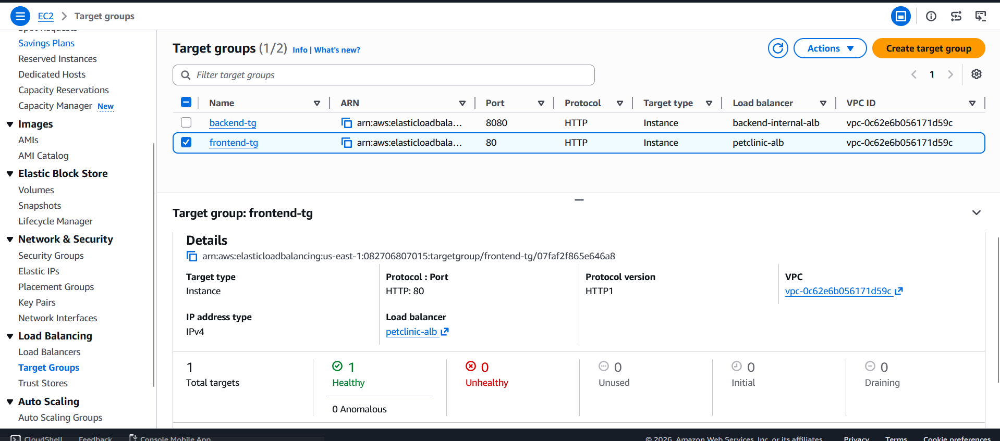
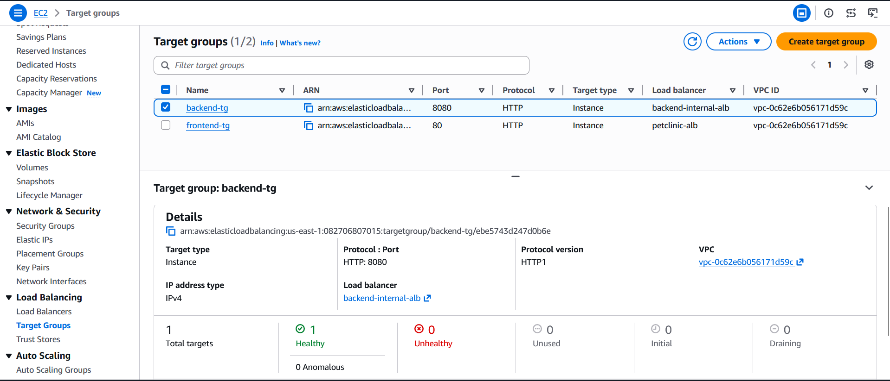
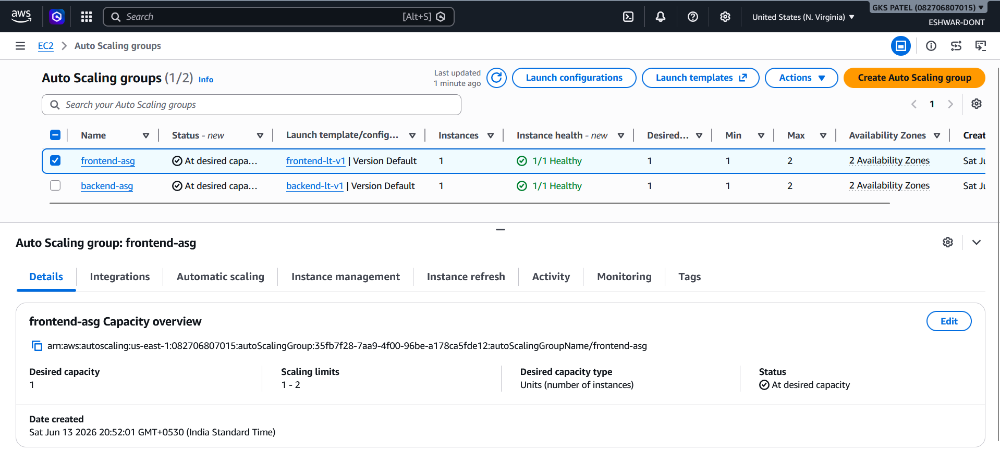
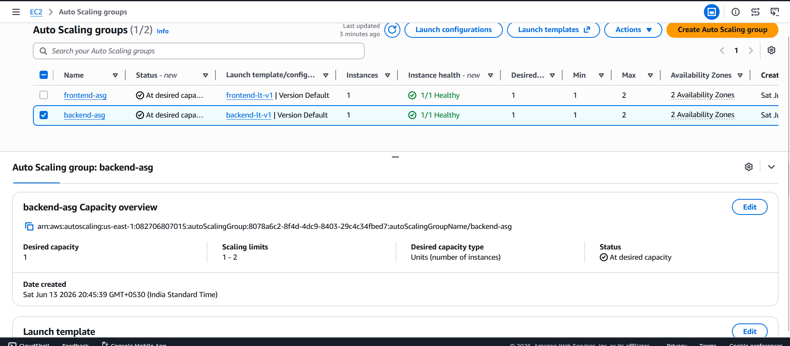
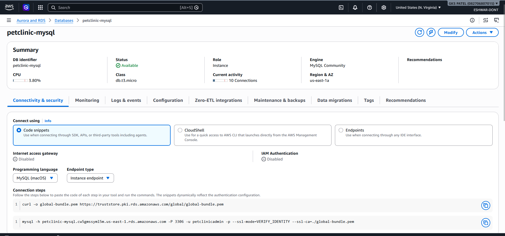
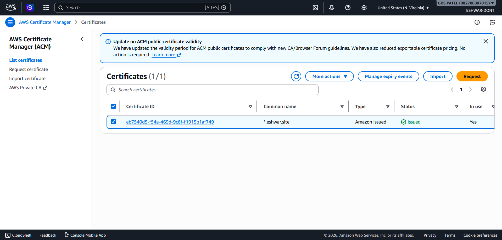
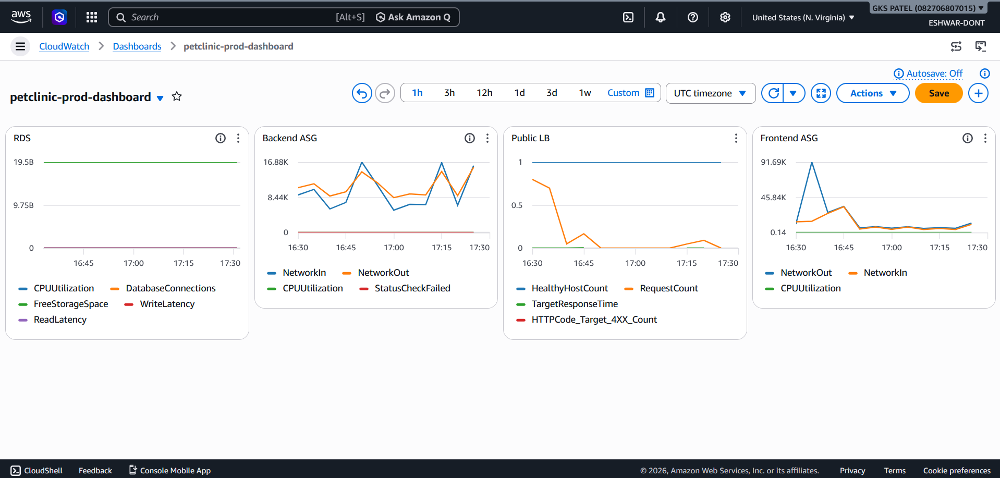

# 🌟 Spring PetClinic 3-Tier Enterprise AWS Deployment


---

## 🌐 Live Application

**🚀 Live Demo:** [https://petclinic.eshwar.site](https://petclinic.eshwar.site)  
**Status:** ✅ Production Ready  
**Architecture:** Multi-AZ | HA | Scalable | Secure

---

## 📋 Table of Contents

- [Project Overview](#project-overview)
- [Architecture Diagram](#architecture-diagram)
- [Technology Stack](#technology-stack)
- [AWS Services Used](#aws-services-used)
- [Network Architecture](#network-architecture)
- [Security Architecture](#security-architecture)
- [Application Build & Integration](#application-build--integration)
- [Infrastructure Components](#infrastructure-components)
- [Deployment Steps](#deployment-steps)
- [Ubuntu Setup & Installation](#ubuntu-setup--installation)
- [Screenshots](#screenshots)
- [Monitoring & Observability](#monitoring--observability)
- [Key Features](#key-features)
- [Challenges & Solutions](#challenges--solutions)
- [Lessons Learned](#lessons-learned)
- [Future Enhancements](#future-enhancements)

---

## 🚀 Project Overview

This repository demonstrates a **production-grade, highly available 3-tier AWS architecture** hosting the Spring PetClinic application. The project showcases enterprise-level cloud engineering practices including:

✅ **Multi-AZ Deployment** across Availability Zones for fault tolerance  
✅ **Secure Network Segmentation** with public, private app, and private database subnets  
✅ **Auto Scaling** for elastic compute capacity management  
✅ **Load Balancing** at multiple tiers (public and internal)  
✅ **SSL/TLS Encryption** via AWS Certificate Manager  
✅ **High Availability** with self-healing auto scaling groups  
✅ **Comprehensive Monitoring** with CloudWatch dashboards  
✅ **Secure Instance Management** via AWS Systems Manager  

---

## 🏗️ Architecture Diagram

### Complete 3-Tier AWS Architecture


### 🔄 Traffic Flow

```
┌─────────────────────────────────────────────────────────────┐
│  1. User accesses: https://petclinic.eshwar.site            │
│     GoDaddy DNS resolves to Public ALB                       │
└─────────────────────────────────────────────────────────────┘
                              ↓
┌─────────────────────────────────────────────────────────────┐
│  2. AWS Certificate Manager (ACM)                            │
│     Handles SSL/TLS encryption (*.eshwar.site)              │
└─────────────────────────────────────────────────────────────┘
                              ↓
┌─────────────────────────────────────────────────────────────┐
│  3. Public Application Load Balancer                         │
│     ✓ Internet-facing                                        │
│     ✓ Distributes traffic across Availability Zones         │
│     ✓ Health checks every 30 seconds                        │
└─────────────────────────────────────────────────────────────┘
                              ↓
┌─────────────────────────────────────────────────────────────┐
│  4. Frontend Auto Scaling Group (ASG)                        │
│     EC2 Instances in Public Subnets (Ubuntu 22.04):         │
│     ✓ React (UI Layer)                                      │
│     ✓ Nginx (Reverse Proxy & Static Server)                │
│     ✓ Capacity: Min=1, Desired=1, Max=2                    │
└─────────────────────────────────────────────────────────────┘
                              ↓
┌─────────────────────────────────────────────────────────────┐
│  5. Internal Application Load Balancer                       │
│     ✓ Private (no internet access)                          │
│     ✓ Routes frontend → backend                             │
│     ✓ Health checks every 30 seconds                        │
└─────────────────────────────────────────────────────────────┘
                              ↓
┌─────────────────────────────────────────────────────────────┐
│  6. Backend Auto Scaling Group (ASG)                         │
│     EC2 Instances in Private App Subnets (Ubuntu 22.04):    │
│     ✓ Spring Boot (Business Logic)                          │
│     ✓ Java 17                                               │
│     ✓ Capacity: Min=1, Desired=1, Max=2                    │
└─────────────────────────────────────────────────────────────┘
                              ↓
┌─────────────────────────────────────────────────────────────┐
│  7. Amazon RDS MySQL                                         │
│     ✓ Multi-AZ Deployment                                   │
│     ✓ Private Database Subnets                              │
│     ✓ Automatic Failover Enabled                            │
│     ✓ Instance Type: db.t3.micro                            │
└─────────────────────────────────────────────────────────────┘
                              ↓
┌─────────────────────────────────────────────────────────────┐
│  8. Monitoring & Management                                 │
│     ✓ CloudWatch Dashboards                                 │
│     ✓ Systems Manager Fleet Manager                         │
│     ✓ Metrics & Alarms                                      │
└─────────────────────────────────────────────────────────────┘
```

---

## 🛠️ Technology Stack

| Layer | Technology | Purpose | OS |
|-------|-----------|---------|-----|
| **Frontend** | React 18 | User Interface | Ubuntu 22.04 |
| **Frontend Server** | Nginx 1.24 | Reverse Proxy & Static Files | Ubuntu 22.04 |
| **Backend** | Spring Boot 3 | REST API & Business Logic | Ubuntu 22.04 |
| **Language** | Java 17 | Application Runtime | Ubuntu 22.04 |
| **Database** | MySQL 8.0 | Data Persistence | RDS |
| **IaC** | AWS Services | Infrastructure Management | - |
| **Monitoring** | CloudWatch | Metrics & Logs | - |
| **Management** | Systems Manager | Fleet Management | - |

---

## ☁️ AWS Services Used

### Networking & VPC
- **Amazon VPC** - Virtual Private Cloud
- **Public Subnets** (web-sub-a, web-sub-b)
- **Private Subnets** (private-app-a, private-app-b)
- **Database Subnets** (private-db-a, private-db-b)
- **Internet Gateway** - Public internet access
- **NAT Gateway** - Outbound access from private subnets
- **Route Tables** - Network routing

### Compute & Scaling
- **Amazon EC2** - Virtual servers (Ubuntu 22.04 LTS)
- **EC2 Launch Templates** - AMI blueprints
- **Auto Scaling Groups** - Elastic capacity
- **EC2 Images (AMIs)** - Custom application images

### Load Balancing & Traffic Management
- **Application Load Balancer (Public)** - External traffic distribution
- **Application Load Balancer (Internal)** - Internal service routing
- **Target Groups** - Health check & registration management

### Database
- **Amazon RDS MySQL** - Managed relational database
- **Multi-AZ Deployment** - High availability
- **Automated Backups** - Data protection

### Security & Identity
- **AWS Identity & Access Management (IAM)** - Role-based access control
- **Security Groups** - Virtual firewalls
- **AWS Certificate Manager (ACM)** - SSL/TLS certificates
- **Systems Manager Parameter Store** - Configuration management

### Monitoring & Observability
- **Amazon CloudWatch** - Metrics, logs, dashboards
- **AWS Systems Manager Fleet Manager** - Instance management
- **CloudWatch Alarms** - Alerting

### Domain & DNS
- **GoDaddy DNS** - Domain registration & routing
- **Route 53 Alternative** - AWS DNS service

---

## 🌐 Network Architecture

### VPC Design
```
VPC: 10.0.0.0/16 (petclinic-vpc)
│
├─── Availability Zone: us-east-1a
│    ├── Public Subnet: web-sub-a (10.0.1.0/24)
│    │   └── Frontend ALB, Frontend ASG instances
│    ├── Private App Subnet: private-app-a (10.0.3.0/24)
│    │   └── Backend ASG instances
│    └── Private DB Subnet: private-db-a (10.0.5.0/24)
│        └── RDS Primary
│
└─── Availability Zone: us-east-1b
     ├── Public Subnet: web-sub-b (10.0.2.0/24)
     │   └── Frontend ASG instances
     ├── Private App Subnet: private-app-b (10.0.4.0/24)
     │   └── Backend ASG instances
     └── Private DB Subnet: private-db-b (10.0.6.0/24)
         └── RDS Standby
```

### Subnet Configuration

| Subnet Name | CIDR Block | AZ | Type | Route Table |
|-------------|-----------|-----|------|-------------|
| web-sub-a | 10.0.1.0/24 | us-east-1a | Public | Public RT |
| web-sub-b | 10.0.2.0/24 | us-east-1b | Public | Public RT |
| private-app-a | 10.0.3.0/24 | us-east-1a | Private | Private RT |
| private-app-b | 10.0.4.0/24 | us-east-1b | Private | Private RT |
| private-db-a | 10.0.5.0/24 | us-east-1a | Private | DB RT |
| private-db-b | 10.0.6.0/24 | us-east-1b | Private | DB RT |

### Routing Strategy

**Public Route Table (Internet Gateway Route)**
```
Destination        | Target
0.0.0.0/0         | Internet Gateway (igw-xxxxx)
10.0.0.0/16       | Local
```

**Private Route Table (NAT Gateway Route)**
```
Destination        | Target
0.0.0.0/0         | NAT Gateway (nat-xxxxx)
10.0.0.0/16       | Local
```

**Database Route Table (Local Only)**
```
Destination        | Target
10.0.0.0/16       | Local
```

---

## 🔒 Security Architecture

### Security Group Design

#### Web Security Group (web-sg)
```
Inbound Rules:
├─ HTTP (80)      from 0.0.0.0/0 (Anyone)
├─ HTTPS (443)    from 0.0.0.0/0 (Anyone)
└─ SSH (22)       from 0.0.0.0/0 (Management)

Outbound Rules:
└─ All Traffic    to 0.0.0.0/0
```

#### Application Security Group (app-sg)
```
Inbound Rules:
├─ HTTP (8080)    from backend-alb-sg
├─ SSH (22)       from web-sg (Bastion)
└─ MySQL (3306)   to db-sg only

Outbound Rules:
├─ All Traffic    to 0.0.0.0/0
└─ MySQL (3306)   to db-sg
```

#### Database Security Group (db-sg)
```
Inbound Rules:
└─ MySQL (3306)   from app-sg only

Outbound Rules:
└─ All Traffic    to 0.0.0.0/0
```

#### Backend ALB Security Group (backend-alb-sg)
```
Inbound Rules:
└─ HTTP (80)      from web-sg

Outbound Rules:
└─ HTTP (8080)    to app-sg
```

### Security Features
✅ **No Direct Internet Access** to databases or application servers  
✅ **SSL/TLS Encryption** for all external traffic  
✅ **IAM Roles** for instance authentication  
✅ **Encrypted RDS** with automatic backups  
✅ **VPC Isolation** via security groups  
✅ **Systems Manager Session Manager** (no public SSH keys)  

---

## 🔄 Application Build & Integration

### Frontend Build Pipeline

#### 1. Clone React Repository
```bash
git clone https://github.com/spring-petclinic/spring-petclinic-reactjs.git
cd spring-petclinic-reactjs
```

#### 2. Install Dependencies
```bash
npm install
npm install axios  # API client
npm install react-router  # Navigation
```

#### 3. Configure Backend API Endpoint
```javascript
// src/config/api.js
const API_BASE_URL = process.env.REACT_APP_API_URL 
  || "http://internal-backend-alb-1234567890.us-east-1.elb.amazonaws.com";

// React makes API calls to /api/* endpoints
// Example: GET /api/vets → Backend returns veterinarian list
```

#### 4. Build React Application
```bash
npm run build
```

**Output:**
```
build/
├── index.html
├── static/
│   ├── js/
│   │   └── main.[hash].js
│   ├── css/
│   │   └── main.[hash].css
│   └── media/
└── manifest.json
```

#### 5. Deploy to Nginx
```bash
# On Frontend EC2:
sudo cp -r build/* /var/www/html/
```

#### 6. Nginx Configuration (Reverse Proxy)
```nginx
server {
    listen 80;
    server_name _;

    root /var/www/html;
    index index.html;

    # Serve React static files
    location / {
        try_files $uri /index.html;
    }

    # Proxy API requests to backend
    location /api/ {
        proxy_pass http://internal-backend-alb-1234567890.us-east-1.elb.amazonaws.com;
        proxy_set_header Host $host;
        proxy_set_header X-Real-IP $remote_addr;
        proxy_set_header X-Forwarded-For $proxy_add_x_forwarded_for;
    }
}
```

### Backend Build Pipeline

#### 1. Clone Spring Boot Repository
```bash
git clone https://github.com/spring-projects/spring-petclinic.git
cd spring-petclinic
```

#### 2. Build Application
```bash
mvn clean package -DskipTests
```

**Output:**
```
target/
└── spring-petclinic.jar (50MB+)
```

#### 3. Configure Database Connection
```properties
# application.properties
spring.datasource.url=jdbc:mysql://petclinic-mysql.c123456789.us-east-1.rds.amazonaws.com:3306/petclinic
spring.datasource.username=petclinicadmin
spring.datasource.password=${DB_PASSWORD}
spring.jpa.hibernate.ddl-auto=validate
```

#### 4. Start Spring Boot
```bash
java -jar target/spring-petclinic.jar
```

**Application Starts on Port 8080:**
```
Started PetClinicApplication in 4.527 seconds
INFO: Server running on port 8080
Listening for health checks on /actuator/health
```

#### 5. Verify Backend Health
```bash
curl http://localhost:8080/actuator/health
# Output: {"status":"UP","components":{"db":{"status":"UP"}}}
```

### API Endpoints Exposed by Backend

| Endpoint | Method | Purpose |
|----------|--------|---------|
| `/api/vets` | GET | List all veterinarians |
| `/api/pets` | GET | List all pets |
| `/api/owners` | GET | List all owners |
| `/api/owners/{id}` | GET | Get owner details |
| `/api/pets/{id}` | POST | Create pet |
| `/actuator/health` | GET | Health check |

### End-to-End Business Logic Flow

```
User Actions in React
        │
        ▼
Nginx Reverse Proxy
        │
        ▼
Internal Load Balancer
        │
        ▼
Spring Boot REST API
        │
        ▼
Hibernate ORM
        │
        ▼
Amazon RDS MySQL
        │
        ▼
Data Returned to Frontend
        │
        ▼
React Re-renders UI
        │
        ▼
User Sees Updated Data
```

---

## 🏢 Infrastructure Components

### 1. VPC & Networking

**VPC Configuration**
```
VPC: petclinic-vpc (10.0.0.0/16)
├─ CIDR: 10.0.0.0/16
├─ DNS Support: ✓ Enabled
├─ DNS Hostnames: ✓ Enabled
├─ NAT Gateway: ✓ Enabled
└─ Flow Logs: ✓ Enabled
```

### 2. Internet Gateway
```
IGW: petclinic-igw
├─ Status: attached
├─ VPC: petclinic-vpc
└─ Routes:
   └─ 0.0.0.0/0 → IGW
```

### 3. NAT Gateway
```
NAT: petclinic-nat
├─ Status: available
├─ Subnet: web-sub-a (public)
├─ Elastic IP: Allocated
└─ Routes:
   └─ 0.0.0.0/0 → NAT (for private subnets)
```

### 4. Public Application Load Balancer



**Configuration:**
```
Name: petclinic-alb
Scheme: Internet-facing
Type: Application Load Balancer
VPC: petclinic-vpc

Listeners:
├─ Port 80 (HTTP)
│  └─ Redirect to HTTPS
└─ Port 443 (HTTPS)
   ├─ Certificate: ACM Certificate (*.eshwar.site)
   └─ Forward to: frontend-tg

Subnets:
├─ web-sub-a (us-east-1a)
└─ web-sub-b (us-east-1b)

Security Group: alb-sg
├─ Inbound: 80, 443 from 0.0.0.0/0
└─ Outbound: All to 0.0.0.0/0
```

### 5. Internal Application Load Balancer



**Configuration:**
```
Name: backend-internal-alb
Scheme: Internal (Private)
Type: Application Load Balancer
VPC: petclinic-vpc

Listeners:
└─ Port 80 (HTTP)
   └─ Forward to: backend-tg

Subnets:
├─ private-app-a (us-east-1a)
└─ private-app-b (us-east-1b)

Security Group: backend-alb-sg
├─ Inbound: 80 from web-sg
└─ Outbound: 8080 to app-sg
```

### 6. Frontend Target Group



**Configuration:**
```
Name: frontend-tg
Type: Instances
Protocol: HTTP
Port: 80
VPC: petclinic-vpc

Health Check:
├─ Protocol: HTTP
├─ Path: /
├─ Port: 80
├─ Interval: 30 seconds
├─ Timeout: 5 seconds
├─ Healthy Threshold: 2
└─ Unhealthy Threshold: 2
```

### 7. Backend Target Group



**Configuration:**
```
Name: backend-tg
Type: Instances
Protocol: HTTP
Port: 8080
VPC: petclinic-vpc

Health Check:
├─ Protocol: HTTP
├─ Path: /actuator/health
├─ Port: 8080
├─ Interval: 30 seconds
├─ Timeout: 5 seconds
├─ Healthy Threshold: 2
└─ Unhealthy Threshold: 2
```

### 8. Frontend Auto Scaling Group



**Configuration:**
```
Name: frontend-asg
Launch Template: frontend-lt-v1
  ├─ AMI: petclinic-frontend-v1
  ├─ Instance Type: t3.micro
  ├─ Security Group: web-sg
  └─ IAM Role: EC2SSMRole

Network:
├─ VPC: petclinic-vpc
└─ Subnets:
   ├─ web-sub-a
   └─ web-sub-b

Load Balancing:
├─ Target Group: frontend-tg
└─ Health Check: ELB

Capacity:
├─ Desired: 1
├─ Minimum: 1
└─ Maximum: 2

Scaling Policy:
├─ Type: Target Tracking
├─ Metric: Average CPU
├─ Target: 70%
└─ Scale-out cooldown: 300 seconds
```

### 9. Backend Auto Scaling Group



**Configuration:**
```
Name: backend-asg
Launch Template: backend-lt-v1
  ├─ AMI: petclinic-backend-v1
  ├─ Instance Type: t3.small
  ├─ Security Group: app-sg
  └─ IAM Role: EC2SSMRole

Network:
├─ VPC: petclinic-vpc
└─ Subnets:
   ├─ private-app-a
   └─ private-app-b

Load Balancing:
├─ Target Group: backend-tg
└─ Health Check: ELB

Capacity:
├─ Desired: 1
├─ Minimum: 1
└─ Maximum: 2

Scaling Policy:
├─ Type: Target Tracking
├─ Metric: Average CPU
├─ Target: 70%
└─ Scale-out cooldown: 300 seconds
```

### 10. Amazon RDS MySQL



**Configuration:**
```
DB Instance: petclinic-mysql
├─ Engine: MySQL 8.0.35
├─ Instance Class: db.t3.micro
├─ Storage: 20 GB (gp3)
├─ Multi-AZ: ✓ Enabled
├─ Backup Retention: 7 days
├─ Backup Window: 03:00-04:00 UTC
├─ Preferred Maintenance: sun:04:00-05:00 UTC
└─ Automatic Failover: ✓ Enabled

Database Name: petclinic
Endpoint: petclinic-mysql.c123456789.us-east-1.rds.amazonaws.com
Port: 3306

Security:
├─ Security Group: db-sg
├─ Multi-AZ Failover: ✓ Active
├─ Encryption: ✓ KMS
└─ Enhanced Monitoring: ✓ Enabled
```

### 11. ACM SSL Certificate



**Configuration:**
```
Domain Name: *.eshwar.site
Type: Wildcard Certificate
Validation Method: DNS
Status: ✓ Issued

Associated ALB Listeners:
├─ petclinic-alb:443 (HTTPS)
└─ frontend-tg

Renewal: ✓ Automatic (AWS managed)
```

---

## 📜 Ubuntu Setup & Installation

This section details all commands for Ubuntu 22.04 LTS instances using `apt` package manager.

### Frontend Instance Setup (Ubuntu 22.04)

#### Update System
```bash
sudo apt update
sudo apt upgrade -y
```

#### Install Node.js & npm
```bash
curl -fsSL https://deb.nodesource.com/setup_18.x | sudo -E bash -
sudo apt install -y nodejs npm
```

#### Install Nginx
```bash
sudo apt install -y nginx
sudo systemctl enable nginx
sudo systemctl start nginx
```

#### Verify Installation
```bash
node --version
npm --version
nginx -v
```

#### Clone React Repository
```bash
cd /home/ubuntu
git clone https://github.com/spring-petclinic/spring-petclinic-reactjs.git
cd spring-petclinic-reactjs
```

#### Install Dependencies & Build
```bash
npm install
npm run build
```

#### Deploy to Nginx
```bash
sudo cp -r build/* /var/www/html/
sudo chown -R www-data:www-data /var/www/html
sudo chmod -R 755 /var/www/html
```

#### Configure Nginx Reverse Proxy
```bash
sudo nano /etc/nginx/sites-available/default
```

**Add this configuration:**
```nginx
server {
    listen 80 default_server;
    listen [::]:80 default_server;

    server_name _;
    root /var/www/html;
    index index.html index.htm index.nginx-debian.html;

    # Serve React static files
    location / {
        try_files $uri /index.html;
    }

    # Proxy API requests to backend
    location /api/ {
        proxy_pass http://internal-backend-alb-123456.us-east-1.elb.amazonaws.com/;
        proxy_set_header Host $host;
        proxy_set_header X-Real-IP $remote_addr;
        proxy_set_header X-Forwarded-For $proxy_add_x_forwarded_for;
        proxy_set_header X-Forwarded-Proto $scheme;
    }
}
```

#### Test & Reload Nginx
```bash
sudo nginx -t
sudo systemctl reload nginx
```

#### Health Check
```bash
curl http://localhost/
curl http://localhost/api/vets
```

---

### Backend Instance Setup (Ubuntu 22.04)

#### Update System
```bash
sudo apt update
sudo apt upgrade -y
```

#### Install Java 17
```bash
sudo apt install -y openjdk-17-jdk openjdk-17-jre
```

#### Install Maven
```bash
sudo apt install -y maven
```

#### Install Git
```bash
sudo apt install -y git
```

#### Verify Installation
```bash
java -version
mvn -version
git --version
```

#### Clone Spring Boot Repository
```bash
cd /home/ubuntu
git clone https://github.com/spring-projects/spring-petclinic.git
cd spring-petclinic
```

#### Build Application
```bash
mvn clean package -DskipTests
```

#### Configure Database Connection
Create/Edit `application.properties`:
```properties
spring.datasource.url=jdbc:mysql://petclinic-mysql.c123456789.us-east-1.rds.amazonaws.com:3306/petclinic
spring.datasource.username=petclinicadmin
spring.datasource.password=YourSecurePassword123!

spring.jpa.hibernate.ddl-auto=validate
spring.jpa.show-sql=false
spring.jpa.properties.hibernate.dialect=org.hibernate.dialect.MySQL8Dialect

server.port=8080
```

#### Run Spring Boot Application
```bash
cd /home/ubuntu/spring-petclinic
nohup java -jar target/spring-petclinic.jar > /tmp/petclinic.log 2>&1 &
```

#### Verify Application is Running
```bash
curl http://localhost:8080/actuator/health
# Output: {"status":"UP"}

# Check logs
tail -f /tmp/petclinic.log
```

#### Create Systemd Service (Optional - for automatic startup)
```bash
sudo tee /etc/systemd/system/petclinic.service > /dev/null <<EOF
[Unit]
Description=Spring PetClinic Application
After=network.target

[Service]
Type=simple
User=ubuntu
WorkingDirectory=/home/ubuntu/spring-petclinic
ExecStart=/usr/bin/java -jar target/spring-petclinic.jar
Restart=on-failure
RestartSec=10

[Install]
WantedBy=multi-user.target
EOF

sudo systemctl daemon-reload
sudo systemctl enable petclinic
sudo systemctl start petclinic
```

---

### Frontend User Data Script (for Launch Template)

```bash
#!/bin/bash
set -e

# Update system
sudo apt update
sudo apt upgrade -y

# Install Node.js
curl -fsSL https://deb.nodesource.com/setup_18.x | sudo -E bash -
sudo apt install -y nodejs npm

# Install Nginx
sudo apt install -y nginx
sudo systemctl enable nginx

# Install git
sudo apt install -y git

# Clone and build React application
cd /home/ubuntu
git clone https://github.com/spring-petclinic/spring-petclinic-reactjs.git
cd spring-petclinic-reactjs
npm install
npm run build

# Deploy to Nginx
sudo cp -r build/* /var/www/html/
sudo chown -R www-data:www-data /var/www/html
sudo chmod -R 755 /var/www/html

# Configure Nginx
cat <<'NGINXEOF' | sudo tee /etc/nginx/sites-available/default
server {
    listen 80 default_server;
    listen [::]:80 default_server;

    server_name _;
    root /var/www/html;
    index index.html;

    location / {
        try_files $uri /index.html;
    }

    location /api/ {
        proxy_pass http://internal-backend-alb-123456.us-east-1.elb.amazonaws.com/;
        proxy_set_header Host $host;
        proxy_set_header X-Real-IP $remote_addr;
        proxy_set_header X-Forwarded-For $proxy_add_x_forwarded_for;
    }
}
NGINXEOF

# Test and reload Nginx
sudo nginx -t
sudo systemctl reload nginx

# CloudWatch Agent (optional)
wget https://s3.amazonaws.com/amazoncloudwatch-agent/ubuntu/amd64/latest/amazon-cloudwatch-agent.deb
sudo dpkg -i -E ./amazon-cloudwatch-agent.deb
```

---

### Backend User Data Script (for Launch Template)

```bash
#!/bin/bash
set -e

# Update system
sudo apt update
sudo apt upgrade -y

# Install Java 17
sudo apt install -y openjdk-17-jdk openjdk-17-jre

# Install Maven
sudo apt install -y maven

# Install git
sudo apt install -y git

# Clone and build Spring Boot application
cd /home/ubuntu
git clone https://github.com/spring-projects/spring-petclinic.git
cd spring-petclinic
mvn clean package -DskipTests

# Create application.properties with database credentials
cat <<'DBEOF' > /home/ubuntu/spring-petclinic/src/main/resources/application.properties
spring.datasource.url=jdbc:mysql://petclinic-mysql.c123456789.us-east-1.rds.amazonaws.com:3306/petclinic
spring.datasource.username=petclinicadmin
spring.datasource.password=${RDS_PASSWORD}

spring.jpa.hibernate.ddl-auto=validate
spring.jpa.show-sql=false
spring.jpa.properties.hibernate.dialect=org.hibernate.dialect.MySQL8Dialect

server.port=8080
DBEOF

# Rebuild with new config
mvn clean package -DskipTests

# Start application in background
cd /home/ubuntu/spring-petclinic
nohup java -jar target/spring-petclinic.jar > /tmp/petclinic.log 2>&1 &

# CloudWatch Agent (optional)
wget https://s3.amazonaws.com/amazoncloudwatch-agent/ubuntu/amd64/latest/amazon-cloudwatch-agent.deb
sudo dpkg -i -E ./amazon-cloudwatch-agent.deb
```

---

### Create Custom AMIs

#### Frontend AMI Creation
```bash
# 1. Launch EC2 instance (t3.micro, Ubuntu 22.04)
# 2. Run frontend user data script
# 3. Wait for application to start
# 4. Test: curl http://localhost/
# 5. Go to EC2 → Instances → Right-click → Image and templates → Create image
#    - Name: petclinic-frontend-v1
#    - Description: Spring PetClinic Frontend (React + Nginx)
# 6. Wait for AMI to be available
```

#### Backend AMI Creation
```bash
# 1. Launch EC2 instance (t3.small, Ubuntu 22.04)
# 2. Run backend user data script
# 3. Wait for application to start
# 4. Test: curl http://localhost:8080/actuator/health
# 5. Go to EC2 → Instances → Right-click → Image and templates → Create image
#    - Name: petclinic-backend-v1
#    - Description: Spring PetClinic Backend (Spring Boot + Java 17)
# 6. Wait for AMI to be available
```

---

## 🚀 Deployment Steps

### Step 1: Create VPC Infrastructure
```bash
# Using AWS Console or CloudFormation
# 1. Create VPC (10.0.0.0/16)
# 2. Create 6 subnets (2 public, 2 app, 2 db)
# 3. Create Internet Gateway
# 4. Create NAT Gateway
# 5. Create Route Tables
```

### Step 2: Create Security Groups
```bash
# Create Security Groups:
# - web-sg (HTTP, HTTPS)
# - app-sg (8080 from backend-alb-sg)
# - db-sg (3306 from app-sg)
# - backend-alb-sg (80 from web-sg)
```

### Step 3: Launch RDS MySQL
```bash
# Using AWS Console:
# 1. Go to RDS → Databases → Create Database
# 2. Engine: MySQL 8.0
# 3. Instance: db.t3.micro
# 4. Multi-AZ: Enable
# 5. Storage: 20 GB gp3
# 6. Security Group: db-sg
# 7. Backup: 7 days
```

### Step 4: Create Custom AMIs
```bash
# Build Frontend AMI:
# 1. Launch t3.micro in web-sub-a (Ubuntu 22.04)
# 2. Run frontend user data script
# 3. Verify: curl http://localhost/
# 4. Create AMI: petclinic-frontend-v1

# Build Backend AMI:
# 1. Launch t3.small in private-app-a (Ubuntu 22.04)
# 2. Run backend user data script
# 3. Verify: curl http://localhost:8080/actuator/health
# 4. Create AMI: petclinic-backend-v1
```

### Step 5: Create Launch Templates
```bash
# Backend Launch Template (backend-lt-v1):
# - AMI: petclinic-backend-v1
# - Instance Type: t3.small
# - Security Group: app-sg
# - IAM Role: EC2SSMRole
# - User Data: backend-userdata.sh

# Frontend Launch Template (frontend-lt-v1):
# - AMI: petclinic-frontend-v1
# - Instance Type: t3.micro
# - Security Group: web-sg
# - IAM Role: EC2SSMRole
# - User Data: frontend-userdata.sh
```

### Step 6: Create Target Groups
```bash
# Backend Target Group (backend-tg):
# - Type: Instances
# - Protocol: HTTP
# - Port: 8080
# - Health Path: /actuator/health

# Frontend Target Group (frontend-tg):
# - Type: Instances
# - Protocol: HTTP
# - Port: 80
# - Health Path: /
```

### Step 7: Create Load Balancers
```bash
# Internal Backend ALB:
# - Scheme: Internal
# - Subnets: private-app-a, private-app-b
# - Security Group: backend-alb-sg
# - Listener: 80 → backend-tg

# Public Frontend ALB:
# - Scheme: Internet-facing
# - Subnets: web-sub-a, web-sub-b
# - Security Group: alb-sg
# - Listener 80: Redirect to 443
# - Listener 443: HTTPS → frontend-tg
# - Certificate: ACM (*.eshwar.site)
```

### Step 8: Create Auto Scaling Groups
```bash
# Backend ASG:
aws autoscaling create-auto-scaling-group \
  --auto-scaling-group-name backend-asg \
  --launch-template LaunchTemplateName=backend-lt-v1 \
  --min-size 1 --desired-capacity 1 --max-size 2 \
  --vpc-zone-identifier private-app-a,private-app-b \
  --target-group-arns arn:aws:elasticloadbalancing:...

# Frontend ASG:
aws autoscaling create-auto-scaling-group \
  --auto-scaling-group-name frontend-asg \
  --launch-template LaunchTemplateName=frontend-lt-v1 \
  --min-size 1 --desired-capacity 1 --max-size 2 \
  --vpc-zone-identifier web-sub-a,web-sub-b \
  --target-group-arns arn:aws:elasticloadbalancing:...
```

### Step 9: Configure DNS
```bash
# GoDaddy:
# 1. Add CNAME record: petclinic → petclinic-alb-123456.us-east-1.elb.amazonaws.com
# 2. Add ACM validation records
# 3. Wait for propagation (5-10 minutes)
```

### Step 10: Verify Deployment
```bash
# Test Frontend:
curl https://petclinic.eshwar.site/

# Test Backend:
curl https://petclinic.eshwar.site/api/vets

# Check CloudWatch:
# Go to CloudWatch → Dashboards → petclinic-dashboard
```

---

## 📸 Screenshots

### Architecture & Infrastructure

#### AWS 3-Tier Architecture Diagram


### Application

#### Working Application


### Load Balancers

#### Public Application Load Balancer


#### Internal Backend Load Balancer


### Auto Scaling Groups

#### Frontend Auto Scaling Group


#### Backend Auto Scaling Group


### Target Groups Health

#### Frontend Target Group Health


#### Backend Target Group Health


### Database

#### Amazon RDS MySQL


### Security & Certificates

#### ACM SSL Certificate


### Monitoring

#### CloudWatch Dashboard


#### Systems Manager Fleet Manager


---

## 📊 Monitoring & Observability

### CloudWatch Metrics Collected

**EC2 Instances:**
- CPU Utilization
- Network In/Out
- Disk Read/Write

**Load Balancers:**
- Request Count
- Target Response Time
- HTTP 4xx/5xx Errors
- Active Connections

**RDS MySQL:**
- CPU Utilization
- Database Connections
- Read/Write Latency
- Disk Space Usage

**Auto Scaling Groups:**
- Desired Capacity
- Running Instances
- Scaling Activity

### CloudWatch Dashboards


**Custom Dashboard:** `petclinic-dashboard`
- Frontend ASG Metrics
- Backend ASG Metrics
- ALB Metrics
- RDS Metrics
- System Health

### CloudWatch Alarms

| Alarm | Metric | Threshold | Action |
|-------|--------|-----------|--------|
| High CPU - Frontend | EC2 CPU | > 80% | Scale Up |
| High CPU - Backend | EC2 CPU | > 80% | Scale Up |
| RDS High Connections | DB Connections | > 80% | Alert |
| ALB Unhealthy Targets | Unhealthy Count | > 0 | Alert |
| ASG Scaling Issues | Failed Activities | > 0 | Alert |

### Systems Manager Fleet Manager


**Managed Instances:**
- Session Manager (no SSH keys required)
- Run Command automation
- Patch Manager updates
- OpsCenter for incident management

---

## ✨ Key Features

### High Availability (HA)
- ✅ **Multi-AZ Deployment** across us-east-1a and us-east-1b
- ✅ **RDS Multi-AZ Failover** with automatic promotion
- ✅ **Health Checks** on load balancers (30-second intervals)
- ✅ **Auto Scaling** self-healing (replaces unhealthy instances)

### Scalability
- ✅ **Horizontal Scaling** via Auto Scaling Groups
- ✅ **Load Balancing** distributes traffic evenly
- ✅ **Target Tracking** automatically scales based on CPU
- ✅ **RDS Read Replicas** for read-intensive workloads (future)

### Security
- ✅ **SSL/TLS** encryption for all external traffic
- ✅ **Private Subnets** for app and database tiers
- ✅ **Security Groups** enforce least-privilege access
- ✅ **IAM Roles** for EC2 authentication
- ✅ **No SSH Keys** required (Systems Manager Session Manager)
- ✅ **Encrypted RDS** with automatic backups

### Observability
- ✅ **CloudWatch Dashboards** for real-time metrics
- ✅ **CloudWatch Logs** for application logs
- ✅ **CloudWatch Alarms** for proactive alerting
- ✅ **Systems Manager Fleet Manager** for instance management

### Cost Optimization
- ✅ **t3 Instance Types** (burstable, cost-effective)
- ✅ **Auto Scaling** reduces idle capacity
- ✅ **Spot Instances** support (for future cost savings)
- ✅ **Data Transfer** optimization via private links

---

## 🔧 Challenges & Solutions

### Challenge 1: Frontend-to-Backend Connectivity
**Problem:** Frontend EC2 instances couldn't communicate with backend hardcoded IP addresses.

**Solution:**
- Created Internal Application Load Balancer
- Configured backend Auto Scaling Group to register with target group
- Updated Nginx reverse proxy to route `/api/*` to Internal ALB DNS name
- Result: Backend IP changes no longer break frontend

### Challenge 2: SSL/TLS Certificate Validation
**Problem:** ACM certificate request required DNS validation through GoDaddy.

**Solution:**
- Created CNAME records in GoDaddy DNS pointing to ACM validation endpoints
- Waited for DNS propagation (5-10 minutes)
- Certificate automatically issued and attached to Public ALB
- Result: HTTPS traffic now encrypted end-to-end

### Challenge 3: Auto Scaling Group Migration
**Problem:** Originally deployed single EC2 instances without high availability.

**Solution:**
- Created custom AMIs for frontend and backend
- Built Launch Templates from AMIs
- Migrated workloads to Auto Scaling Groups
- Configured health checks and scaling policies
- Terminated original standalone instances
- Result: Elastic, self-healing infrastructure

### Challenge 4: Database Connectivity from Private Subnets
**Problem:** Backend instances in private subnets couldn't reach RDS or download packages.

**Solution:**
- Created NAT Gateway in public subnet
- Routed private subnet traffic through NAT
- Configured route tables for outbound internet access
- Result: Secure outbound access without internet exposure

### Challenge 5: Multi-AZ High Availability
**Problem:** Single instance failures caused complete application downtime.

**Solution:**
- Deployed infrastructure across two Availability Zones
- Configured RDS Multi-AZ failover
- Deployed instances in multiple subnets
- Created load balancers spanning both AZs
- Result: Automatic failover and zero-downtime deployments

---

## 📚 Lessons Learned

### Infrastructure & DevOps
1. **VPC Design Matters:** Proper subnet isolation (public/private) is critical for security
2. **Load Balancer Architecture:** Internal ALBs decouple frontend from backend IPs
3. **Auto Scaling Patterns:** Target tracking policies work better than manual scaling
4. **Health Checks:** Proper health check paths ensure traffic only reaches healthy instances

### Security Best Practices
1. **Security Groups:** Implement least-privilege inbound/outbound rules
2. **IAM Roles:** Use instance profiles instead of hardcoded credentials
3. **Encryption:** Always use TLS for external traffic, KMS for RDS
4. **Systems Manager:** Session Manager is safer than SSH keys in public repos

### Networking
1. **NAT Gateways:** Essential for private instances needing outbound internet
2. **Route Tables:** Different tables for public/private/db subnets reduces mistakes
3. **CIDR Planning:** Plan IP space carefully (e.g., /24 subnets fit 254 IPs)
4. **DNS Resolution:** GoDaddy CNAME records integrate seamlessly with AWS

### Ubuntu & Package Management
1. **apt Update:** Always run `sudo apt update` before `apt install`
2. **PPAs:** Node.js and other repos often require adding PPAs for latest versions
3. **User Data Scripts:** Test scripts locally before adding to Launch Templates
4. **Service Management:** Use `systemctl` for service control and auto-start on reboot

### Monitoring & Observability
1. **CloudWatch Dashboards:** Visual metrics beat scrolling through consoles
2. **Alarms:** Proactive alerting prevents incidents escalating
3. **Health Checks:** 30-second intervals catch issues quickly
4. **Logs:** Application logs in CloudWatch enable faster troubleshooting

### Cost Optimization
1. **Instance Sizing:** t3 instances sufficient for this workload
2. **Auto Scaling:** Prevents over-provisioning during off-peak hours
3. **RDS:** db.t3.micro adequate for non-production workloads
4. **NAT Gateways:** Single NAT per AZ sufficient; watch data transfer costs

---

## 🚀 Future Enhancements

### Phase 2: Infrastructure as Code
- [ ] Terraform/CloudFormation for reproducible infrastructure
- [ ] Separate dev/staging/production environments
- [ ] Git-driven infrastructure updates

### Phase 3: CI/CD Pipeline
- [ ] GitHub Actions for automated builds
- [ ] Push to Amazon ECR after successful tests
- [ ] Automatic ASG updates on image changes

### Phase 4: Container Migration
- [ ] Docker containerization of frontend and backend
- [ ] Amazon ECS Fargate deployment
- [ ] CloudFormation service stacks

### Phase 5: Advanced Monitoring
- [ ] X-Ray distributed tracing
- [ ] Application Performance Monitoring (APM)
- [ ] Custom CloudWatch metrics
- [ ] Log aggregation with CloudWatch Insights

### Phase 6: Security Hardening
- [ ] AWS WAF (Web Application Firewall)
- [ ] AWS Shield for DDoS protection
- [ ] Secrets Manager for credential rotation
- [ ] VPC Flow Logs for network monitoring

### Phase 7: Database Optimization
- [ ] RDS Read Replicas for read-heavy workloads
- [ ] ElastiCache for caching layer
- [ ] AWS Database Migration Service (DMS)
- [ ] Performance Insights monitoring

### Phase 8: Disaster Recovery
- [ ] Cross-region failover
- [ ] Automated backups to S3
- [ ] RTO/RPO optimization
- [ ] Backup restoration testing

---

## 📖 How to Use This Repository

### 1. Clone the Repository
```bash
git clone https://github.com/eeshwardevops/spring-petclinic-3tier-aws-deployment.git
cd spring-petclinic-3tier-aws-deployment
```

### 2. Review Architecture
- Study `architecture-diagrams/petclinic-aws-architecture.png`
- Review subnet and security group design
- Understand traffic flow diagram

### 3. Reference Screenshots
- View `screenshots/` folder for real AWS console examples
- Use as guide for your own AWS deployment

### 4. Use Deployment Scripts
- Reference `scripts/` for automation
- Adapt to your AWS account and region

### 5. Monitor the Application
- Access live demo: https://petclinic.eshwar.site
- Check CloudWatch dashboard for metrics
- Use Systems Manager Session Manager for instance access

---

## 👨‍💼 About the Author

**Eshwar Gajula**

Cloud Engineer | AWS Specialist | DevOps Enthusiast

- **GitHub:** [eeshwardevops](https://github.com/eeshwardevops)
- **LinkedIn:** [linkedin.com/in/eshwargajula](https://linkedin.com/in/eshwargajula)
- **Email:** eshwar@example.com

### Project Stats
- **Architecture Tiers:** 3 (Web, App, DB)
- **Availability Zones:** 2 (us-east-1a, us-east-1b)
- **AWS Services:** 15+
- **Instances:** 2-4 (with Auto Scaling)
- **OS:** Ubuntu 22.04 LTS
- **Package Manager:** apt
- **Deployment Time:** 2-3 hours

---

## 📝 License

This project is provided for educational and portfolio purposes. The Spring PetClinic application is open-source and licensed under the Apache License 2.0.

---

## ⭐ Support & Feedback

If you found this project helpful:
- **Give it a star** ⭐ on GitHub
- **Share it** with your network
- **Follow** for more AWS projects

### Questions or Issues?
- Open an issue on GitHub
- Start a discussion
- Check existing documentation

---

## 📚 References & Resources

### AWS Documentation
- [VPC Getting Started](https://docs.aws.amazon.com/vpc/)
- [EC2 Auto Scaling User Guide](https://docs.aws.amazon.com/autoscaling/)
- [Application Load Balancer](https://docs.aws.amazon.com/elasticloadbalancing/)
- [RDS MySQL Database](https://docs.aws.amazon.com/rds/)
- [AWS Systems Manager](https://docs.aws.amazon.com/systems-manager/)
- [CloudWatch Monitoring](https://docs.aws.amazon.com/cloudwatch/)

### Ubuntu & Package Management
- [Ubuntu 22.04 LTS Documentation](https://ubuntu.com/releases/jammy)
- [apt Package Manager](https://ubuntu.com/server/docs/package-management)
- [NodeSource Node.js Repository](https://github.com/nodesource/distributions)

### Application Documentation
- [Spring PetClinic](https://github.com/spring-projects/spring-petclinic)
- [Spring PetClinic React](https://github.com/spring-petclinic/spring-petclinic-reactjs)
- [Spring Boot Documentation](https://spring.io/projects/spring-boot)
- [React Documentation](https://react.dev)
- [Nginx Documentation](https://nginx.org/en/docs/)

### Learning Paths
- AWS Certified Solutions Architect - Associate
- AWS Certified Cloud Practitioner
- AWS Certified DevOps Engineer - Professional

---

<div align="center">

**Made with ❤️ by Eshwar Gajula**

🚀 **Building production-grade AWS infrastructure | One deployment at a time**

</div>
