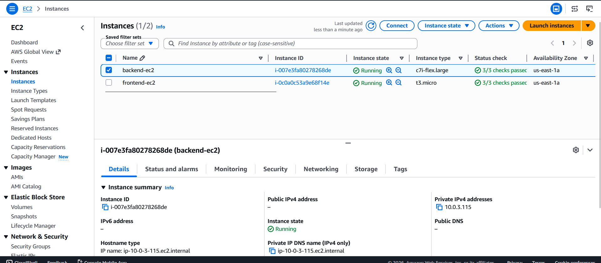
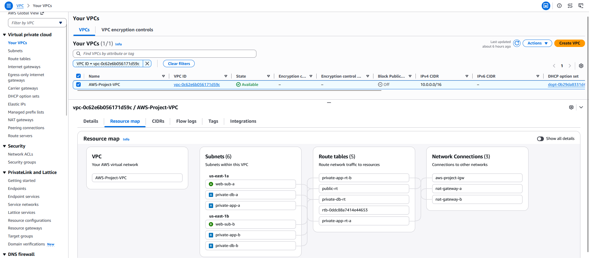
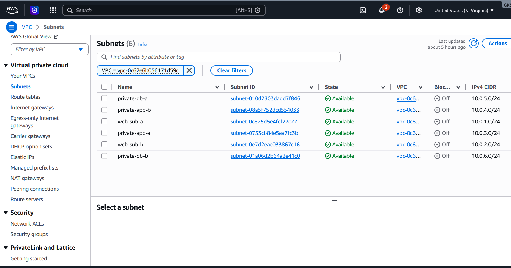
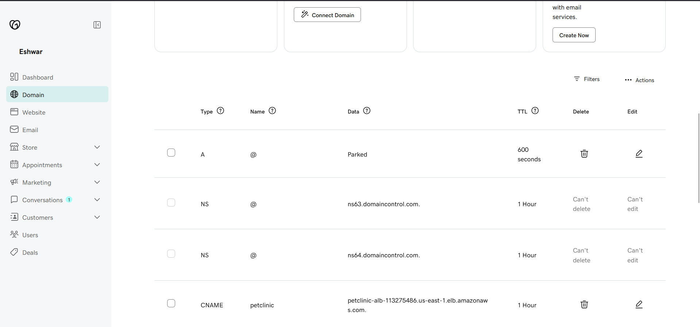
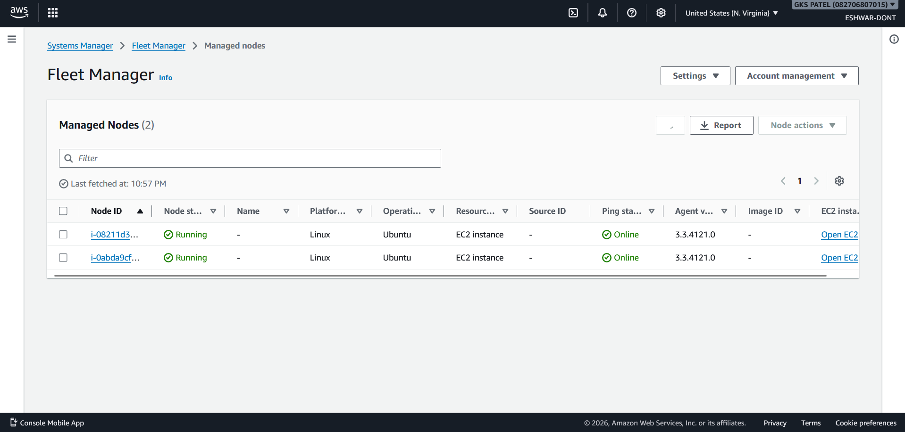
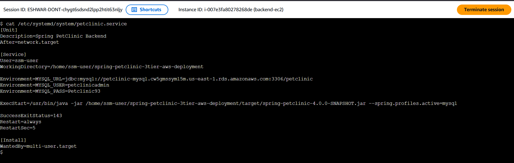
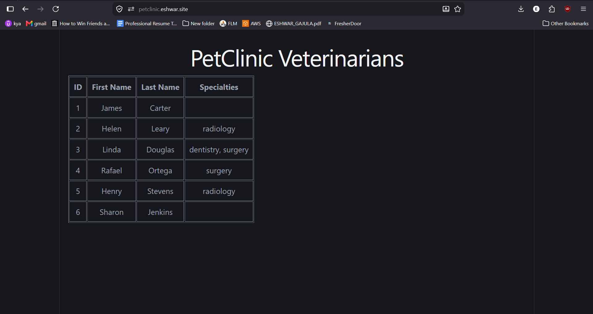

# 🚀 Spring PetClinic 3-Tier AWS Deployment

A production-grade deployment of the **Spring PetClinic Application** on AWS using a highly available and scalable **3-Tier Architecture** following AWS best practices.

**Live Application:** https://petclinic.eshwar.site

---

## 📋 Table of Contents

- [Project Overview](#project-overview)
- [Architecture](#architecture)
- [AWS Services](#aws-services)
- [Network Design](#network-design)
- [Security](#security)
- [Components](#components)
- [Screenshots](#screenshots)
- [Deployment](#deployment)
- [Learning Outcomes](#learning-outcomes)
- [Future Improvements](#future-improvements)

---

## 🎯 Project Overview

This project demonstrates a production-ready deployment architecture that separates concerns across three distinct layers:

- **Presentation Layer (Frontend):** User-facing interface with React + Nginx
- **Application Layer (Backend):** Spring Boot microservices
- **Database Layer:** Amazon RDS MySQL

The infrastructure incorporates:
- ✅ **High Availability** - Multi-AZ deployment across us-east-1a and us-east-1b
- ✅ **Auto Scaling** - Dynamic resource management based on demand
- ✅ **Security** - Layered security groups, SSL/TLS, private subnets
- ✅ **Monitoring** - CloudWatch dashboards and metrics
- ✅ **Load Balancing** - Public and Internal ALBs for traffic distribution

---

## 🏗️ Architecture

### Architecture Diagram

```
┌─────────────────────────────────────────────────────────────────┐
│                      INTERNET / DNS (GoDaddy)                   │
└────────────────────────────┬────────────────────────────────────┘
                             │
                             ▼
                    ┌────────────────┐
                    │  ACM Certificate│
                    │  *.eshwar.site  │
                    └────────┬────────┘
                             │
                             ▼
            ┌────────────────────────────────────┐
            │     PUBLIC ALB (Internet-facing)    │
            │         Port: 80, 443              │
            └─────────┬──────────────┬───────────┘
                      │              │
         ┌────────────┘              └────────────┐
         │                                        │
         ▼                                        ▼
    ┌─────────────┐  us-east-1a            ┌─────────────┐  us-east-1b
    │ Web Subnet A│                        │ Web Subnet B│
    │ 10.0.1.0/24 │  ┌──────────────┐     │ 10.0.2.0/24 │  ┌──────────────┐
    ├─────────────┤  │ Frontend ASG  │     ├─────────────┤  │ Frontend ASG  │
    │ React + Nginx   │ EC2 Instance │     │ React + Nginx   │ EC2 Instance │
    └─────────────┘  └──────────────┘     └─────────────┘  └──────────────┘
         │                                        │
         └────────────────────┬───────────────────┘
                              │
                              ▼
            ┌────────────────────────────────────┐
            │   INTERNAL ALB (Private)            │
            │      Port: 8080                    │
            └─────────┬──────────────┬───────────┘
                      │              │
         ┌────────────┘              └────────────┐
         │                                        │
         ▼                                        ▼
    ┌─────────────┐  us-east-1a            ┌─────────────┐  us-east-1b
    │App Subnet A │                        │App Subnet B │
    │10.0.3.0/24  │  ┌──────────────┐     │10.0.4.0/24  │  ┌──────────────┐
    ├─────────────┤  │ Backend ASG   │     ├─────────────┤  │ Backend ASG   │
    │ Spring Boot     │ EC2 Instance │     │ Spring Boot     │ EC2 Instance │
    │ Java 17         └──────────────┘     │ Java 17         └──────────────┘
    └─────────────┘                        └─────────────┘
         │                                        │
         └────────────────────┬───────────────────┘
                              │
                              ▼
            ┌────────────────────────────────────┐
            │    RDS MySQL (Private)              │
            │      Port: 3306                    │
            │  Multi-AZ Database Subnet Group    │
            └────────────────────────────────────┘
                   us-east-1a  us-east-1b
              DB Subnet A    DB Subnet B
             10.0.5.0/24   10.0.6.0/24
```

### Request Flow

```
User Request
    ↓
GoDaddy Domain → ACM SSL Certificate
    ↓
Public ALB (Port 443)
    ↓
Frontend ASG (React + Nginx on Port 80)
    ↓
Internal ALB (Port 8080)
    ↓
Backend ASG (Spring Boot on Port 8080)
    ↓
Amazon RDS MySQL (Port 3306)
```

---

## ☁️ AWS Services Used

| Service | Purpose | Configuration |
|---------|---------|---------------|
| **Amazon EC2** | Application Hosting | t3.micro instances |
| **Auto Scaling Groups** | High Availability & Elasticity | Min: 1, Max: 2 instances |
| **Application Load Balancer** | Traffic Distribution | Public & Internal ALBs |
| **Amazon RDS MySQL** | Database | db.t3.micro, Multi-AZ |
| **Amazon VPC** | Network Isolation | Custom VPC with 10.0.0.0/16 CIDR |
| **Route Tables** | Network Routing | Public & Private routes |
| **Security Groups** | Network Security | Layered access control |
| **Internet Gateway** | Public Internet Access | VPC connectivity |
| **NAT Gateway** | Private Subnet Internet Access | Outbound only |
| **ACM** | SSL/TLS Certificate | *.eshwar.site |
| **Systems Manager** | Instance Management | Fleet Manager, Session Manager |
| **CloudWatch** | Monitoring & Logging | Dashboards, metrics, alarms |
| **Route 53** (Future) | DNS Management | Custom domain routing |

---

## 🌐 Network Design

### VPC Architecture

```
┌──────────────────────────────────────────────────┐
│           VPC: 10.0.0.0/16                       │
│                                                  │
│  ┌────────────────────────────────────────────┐ │
│  │ Internet Gateway                            │ │
│  └────────────────────────────────────────────┘ │
│                                                  │
│  ┌──────────────────┐  ┌──────────────────────┐│
│  │  PUBLIC SUBNETS  │  │  PRIVATE SUBNETS     ││
│  │   (Tier 1)       │  │   (Tier 2 & 3)       ││
│  ├──────────────────┤  ├──────────────────────┤│
│  │ web-sub-a        │  │ app-sub-a (10.0.3/24)││
│  │ 10.0.1.0/24      │  │ app-sub-b (10.0.4/24)││
│  │                  │  │ db-sub-a  (10.0.5/24)││
│  │ web-sub-b        │  │ db-sub-b  (10.0.6/24)││
│  │ 10.0.2.0/24      │  │                      ││
│  └──────────────────┘  └──────────────────────┘│
│                                                  │
└──────────────────────────────────────────────────┘
```

### Subnets Configuration

| Name | CIDR | Type | Purpose | AZ |
|------|------|------|---------|-----|
| web-sub-a | 10.0.1.0/24 | Public | Frontend instances | us-east-1a |
| web-sub-b | 10.0.2.0/24 | Public | Frontend instances | us-east-1b |
| private-app-a | 10.0.3.0/24 | Private | Backend instances | us-east-1a |
| private-app-b | 10.0.4.0/24 | Private | Backend instances | us-east-1b |
| private-db-a | 10.0.5.0/24 | Private | Database | us-east-1a |
| private-db-b | 10.0.6.0/24 | Private | Database | us-east-1b |

---

## 🔒 Security Architecture

### Security Groups Configuration

#### Web Security Group (Frontend)
```
Ingress Rules:
  ├─ HTTP (Port 80) from Internet (0.0.0.0/0)
  └─ HTTPS (Port 443) from Internet (0.0.0.0/0)

Egress Rules:
  └─ All traffic allowed
```

#### Application Security Group (Backend)
```
Ingress Rules:
  ├─ SSH (Port 22) from Bastion/SSM (for management)
  ├─ HTTP (Port 8080) from Web SG
  └─ All traffic from App SG (for inter-service communication)

Egress Rules:
  └─ All traffic allowed
```

#### Database Security Group
```
Ingress Rules:
  └─ MySQL (Port 3306) from Application SG

Egress Rules:
  └─ All traffic allowed
```

### Security Highlights

✅ **No Direct Internet Access to Backend** - Backend servers in private subnets  
✅ **No Database Internet Exposure** - RDS in private subnets  
✅ **SSL/TLS Encryption** - ACM certificates for all traffic  
✅ **Network Segmentation** - Three-tier security group architecture  
✅ **Session Manager Access** - No SSH keys needed, managed via SSM  
✅ **Database Subnet Group** - Private RDS deployment across AZs  

---

## 📦 Components

### Frontend Layer (Presentation)

- **Technology:** React + Nginx
- **Deployment:** EC2 instances in Public Subnets
- **Load Balancer:** Public Application Load Balancer
- **Auto Scaling:** 1-2 instances based on demand
- **SSL/TLS:** ACM certificate with ACM

### Backend Layer (Application)

- **Technology:** Spring Boot + Java 17
- **Deployment:** EC2 instances in Private App Subnets
- **Load Balancer:** Internal Application Load Balancer
- **Database:** Spring Data JPA with Hibernate
- **Auto Scaling:** 1-2 instances based on demand

### Database Layer (Data)

- **Engine:** MySQL Community Edition
- **Instance Type:** db.t3.micro
- **Storage:** 20GB gp2
- **Deployment:** Multi-AZ RDS in Private DB Subnets
- **Backup:** Automated backups enabled
- **Security:** Encrypted at rest and in transit

---

## 📸 Screenshots

### Architecture & Infrastructure

#### Public Application Load Balancer

*Internet-facing load balancer distributing traffic to frontend instances*

#### Internal Application Load Balancer

*Private load balancer routing traffic from frontend to backend services*

#### Frontend Auto Scaling Group

*Auto Scaling Group managing frontend (React + Nginx) instances*

#### Backend Auto Scaling Group

*Auto Scaling Group managing backend (Spring Boot) instances*

### Target Groups & Health Checks

#### Frontend Target Group

*Health checks and target registration for frontend instances*

#### Backend Target Group

*Health checks and target registration for backend instances*

### EC2 & Networking

#### EC2 Instances

*Running EC2 instances across availability zones*

#### VPC Resource Map

*Complete VPC topology with all resources*

#### VPC Subnets

*Public and private subnets across multiple availability zones*

### Database & Storage

#### Amazon RDS MySQL

*Multi-AZ RDS MySQL database instance with automated backups*

### Certificate & SSL/TLS

#### ACM Certificate

*AWS Certificate Manager certificate for *.eshwar.site*

#### Domain Routing

*GoDaddy domain configured to route to CloudFront/ALB*

### Monitoring & Management

#### CloudWatch Dashboard

*CloudWatch dashboard monitoring EC2, ALB, RDS, and Auto Scaling metrics*

#### Systems Manager Fleet Manager

*AWS Systems Manager for centralized instance management*

#### Systemd Service Configuration

*Systemd service file for Spring Boot application auto-startup*

### Application Status

#### Application Working

*Spring PetClinic application successfully deployed and running*

---

## 🚀 Deployment Steps

### Prerequisites

```bash
# Install AWS CLI
curl "https://awscli.amazonaws.com/awscli-exe-linux-x86_64.zip" -o "awscliv2.zip"
unzip awscliv2.zip
sudo ./aws/install

# Install Maven
sudo apt-get update
sudo apt-get install maven -y

# Install Java 17
sudo apt-get install openjdk-17-jdk -y
```

### Clone Repository

```bash
git clone https://github.com/eeshwardevops/spring-petclinic-3tier-aws-deployment.git
cd spring-petclinic-3tier-aws-deployment
```

### Build Application

```bash
# Build JAR with Maven
mvn clean package -DskipTests

# JAR location
ls -lh target/spring-petclinic-*.jar
```

### Configure VPC & Network

```bash
# Create VPC
aws ec2 create-vpc --cidr-block 10.0.0.0/16

# Create Subnets (6 total - 2 public, 2 app, 2 db)
aws ec2 create-subnet --vpc-id vpc-xxx --cidr-block 10.0.1.0/24 --availability-zone us-east-1a
aws ec2 create-subnet --vpc-id vpc-xxx --cidr-block 10.0.2.0/24 --availability-zone us-east-1b
# ... repeat for app and db subnets

# Create Internet Gateway
aws ec2 create-internet-gateway
aws ec2 attach-internet-gateway --vpc-id vpc-xxx --internet-gateway-id igw-xxx

# Create NAT Gateway for private subnets
aws ec2 allocate-address --domain vpc
aws ec2 create-nat-gateway --subnet-id subnet-xxx --allocation-id eipalloc-xxx
```

### Create Security Groups

```bash
# Web Security Group
aws ec2 create-security-group --group-name web-sg \
  --description "Web tier security group" \
  --vpc-id vpc-xxx

# Application Security Group
aws ec2 create-security-group --group-name app-sg \
  --description "App tier security group" \
  --vpc-id vpc-xxx

# Database Security Group
aws ec2 create-security-group --group-name db-sg \
  --description "Database tier security group" \
  --vpc-id vpc-xxx

# Configure Security Group Rules
aws ec2 authorize-security-group-ingress --group-id sg-web \
  --protocol tcp --port 80 --cidr 0.0.0.0/0
aws ec2 authorize-security-group-ingress --group-id sg-web \
  --protocol tcp --port 443 --cidr 0.0.0.0/0
```

### Create RDS MySQL Database

```bash
# Create DB Subnet Group
aws rds create-db-subnet-group \
  --db-subnet-group-name petclinic-db-subnet-group \
  --db-subnet-group-description "Private subnets for RDS" \
  --subnet-ids subnet-app-a subnet-app-b

# Create RDS Instance
aws rds create-db-instance \
  --db-instance-identifier petclinic-mysql \
  --db-instance-class db.t3.micro \
  --engine mysql \
  --master-username admin \
  --master-user-password 'YourSecurePassword!' \
  --allocated-storage 20 \
  --vpc-security-group-ids sg-database \
  --db-subnet-group-name petclinic-db-subnet-group \
  --multi-az \
  --backup-retention-period 7
```

### Create Load Balancers

```bash
# Create Public ALB for Frontend
aws elbv2 create-load-balancer \
  --name public-alb \
  --subnets subnet-web-a subnet-web-b \
  --security-groups sg-web \
  --scheme internet-facing

# Create Internal ALB for Backend
aws elbv2 create-load-balancer \
  --name internal-alb \
  --subnets subnet-app-a subnet-app-b \
  --security-groups sg-app \
  --scheme internal

# Create Target Groups
aws elbv2 create-target-group \
  --name frontend-targets \
  --protocol HTTP \
  --port 80 \
  --vpc-id vpc-xxx

aws elbv2 create-target-group \
  --name backend-targets \
  --protocol HTTP \
  --port 8080 \
  --vpc-id vpc-xxx
```

### Create Auto Scaling Groups

```bash
# Create Launch Template for Frontend
aws ec2 create-launch-template \
  --launch-template-name frontend-launch-template \
  --version-description "Frontend with React and Nginx" \
  --launch-template-data '{...}'

# Create ASG for Frontend
aws autoscaling create-auto-scaling-group \
  --auto-scaling-group-name frontend-asg \
  --launch-template LaunchTemplateName=frontend-launch-template \
  --min-size 1 \
  --max-size 2 \
  --desired-capacity 1 \
  --vpc-zone-identifier "subnet-web-a,subnet-web-b"

# Repeat for Backend
aws autoscaling create-auto-scaling-group \
  --auto-scaling-group-name backend-asg \
  --launch-template LaunchTemplateName=backend-launch-template \
  --min-size 1 \
  --max-size 2 \
  --desired-capacity 1 \
  --vpc-zone-identifier "subnet-app-a,subnet-app-b"
```

### Configure ACM Certificate & DNS

```bash
# Request ACM Certificate
aws acm request-certificate \
  --domain-name petclinic.eshwar.site \
  --domain-name "*.eshwar.site" \
  --validation-method DNS

# Update GoDaddy DNS to point to ALB
# ALB DNS Name: public-alb-xxx.us-east-1.elb.amazonaws.com
```

### Enable Monitoring

```bash
# Create CloudWatch Dashboard
aws cloudwatch put-dashboard \
  --dashboard-name PetClinic-Dashboard \
  --dashboard-body file://dashboard-config.json
```

---

## 📊 Monitoring & Observability

### CloudWatch Metrics Tracked

- **EC2 Metrics:** CPU Utilization, Network In/Out, Disk I/O
- **ALB Metrics:** Request Count, Target Response Time, HTTP Status Codes
- **RDS Metrics:** CPU Utilization, Database Connections, Query Performance
- **ASG Metrics:** Desired/Current Capacity, Scaling Activities
- **Application Metrics:** Custom metrics from Spring Boot

### Alarms & Notifications

```
High CPU Usage on EC2 → CloudWatch Alarm → SNS → Email Notification
High Response Time on ALB → CloudWatch Alarm → SNS → Escalation
RDS Storage Usage > 80% → CloudWatch Alarm → SNS → Alert
ASG Scaling Activity → CloudWatch Logs → Monitoring
```

---

## 🎯 Learning Outcomes

Through this project, I gained hands-on experience with:

- ✅ **AWS Networking** - VPC, subnets, route tables, IGW, NAT Gateway
- ✅ **EC2 Administration** - Instance types, AMI, security groups, key pairs
- ✅ **Load Balancing** - Public & Internal ALBs, target groups, health checks
- ✅ **Auto Scaling** - Launch templates, ASG policies, scaling activities
- ✅ **Database Management** - RDS MySQL, multi-AZ setup, backup strategies
- ✅ **Security** - Security groups, ACM certificates, SSL/TLS, encryption
- ✅ **Monitoring** - CloudWatch dashboards, metrics, alarms, logs
- ✅ **Systems Manager** - Fleet Manager, Session Manager, instance management
- ✅ **High Availability** - Multi-AZ deployment, failover, redundancy
- ✅ **Production Deployments** - Best practices, scalability, reliability

---

## 🔮 Future Improvements

### Infrastructure & Architecture

- 🚀 **Terraform IaC** - Replace manual AWS CLI with Infrastructure as Code
- 🚀 **Containerization** - Docker containers for frontend and backend
- 🚀 **Amazon ECS/Fargate** - Container orchestration on AWS
- 🚀 **AWS CodePipeline** - CI/CD pipeline for automated deployments
- 🚀 **GitHub Actions** - Automated testing and deployment workflows
- 🚀 **Blue/Green Deployments** - Zero-downtime deployments
- 🚀 **Canary Deployments** - Gradual rollout with traffic shifting

### Security & Compliance

- 🔐 **AWS WAF** - Web Application Firewall protection
- 🔐 **AWS Shield** - DDoS protection
- 🔐 **Secrets Manager** - Centralized secret management
- 🔐 **VPC Flow Logs** - Network traffic analysis
- 🔐 **CloudTrail** - API audit logging

### Networking & Performance

- 🌍 **Route 53** - DNS failover and traffic management
- 🌍 **CloudFront** - Content delivery network for static assets
- 🌍 **Global Accelerator** - Improved application performance
- 🌍 **VPC Endpoints** - Reduced NAT Gateway costs

### Monitoring & Logging

- 📊 **X-Ray** - Distributed tracing for microservices
- 📊 **CloudWatch Logs Insights** - Advanced log analysis
- 📊 **Prometheus + Grafana** - Custom metrics and dashboards
- 📊 **AWS Security Hub** - Centralized security findings

### Cost Optimization

- 💰 **Reserved Instances** - Reduce EC2 costs
- 💰 **Savings Plans** - Flexible pricing commitments
- 💰 **RDS Auto-pause** - Pause database during low traffic
- 💰 **Spot Instances** - Cost-effective compute for non-critical workloads

---

## 📚 Resources & Documentation

- [AWS VPC Documentation](https://docs.aws.amazon.com/vpc/)
- [AWS EC2 Documentation](https://docs.aws.amazon.com/ec2/)
- [AWS RDS Documentation](https://docs.aws.amazon.com/rds/)
- [AWS ALB Documentation](https://docs.aws.amazon.com/elasticloadbalancing/)
- [AWS Auto Scaling Documentation](https://docs.aws.amazon.com/autoscaling/)
- [Spring PetClinic GitHub](https://github.com/spring-projects/spring-petclinic)
- [AWS Architecture Best Practices](https://aws.amazon.com/architecture/best-practices/)

---

## 👨‍💻 Author

**Eshwar Patel**

- **GitHub:** [@eeshwardevops](https://github.com/eeshwardevops)
- **LinkedIn:** [Connect with me](https://linkedin.com)
- **Website:** [petclinic.eshwar.site](https://petclinic.eshwar.site)

---

## ⭐ Support

If you found this project helpful, please consider giving it a ⭐ on GitHub!

Your support motivates me to create more valuable projects and tutorials.

### Repository Links

- **GitHub Repository:** [spring-petclinic-3tier-aws-deployment](https://github.com/eeshwardevops/spring-petclinic-3tier-aws-deployment)
- **Live Application:** [petclinic.eshwar.site](https://petclinic.eshwar.site)

---

## 📜 License

This project is open-source and available under the MIT License.

---

## 🤝 Contributing

Contributions are welcome! Feel free to:

1. Fork this repository
2. Create a feature branch (`git checkout -b feature/amazing-feature`)
3. Commit your changes (`git commit -m 'Add amazing feature'`)
4. Push to the branch (`git push origin feature/amazing-feature`)
5. Open a Pull Request

---

## 📝 Notes

- All AWS resources are deployed in the `us-east-1` region
- The application is configured with a custom domain `petclinic.eshwar.site`
- Database credentials should be stored in AWS Secrets Manager for production
- All backend services run in private subnets for enhanced security
- SSL/TLS encryption is enabled for all external traffic

---

**Last Updated:** June 13, 2026  
**Project Status:** ✅ Production Ready
